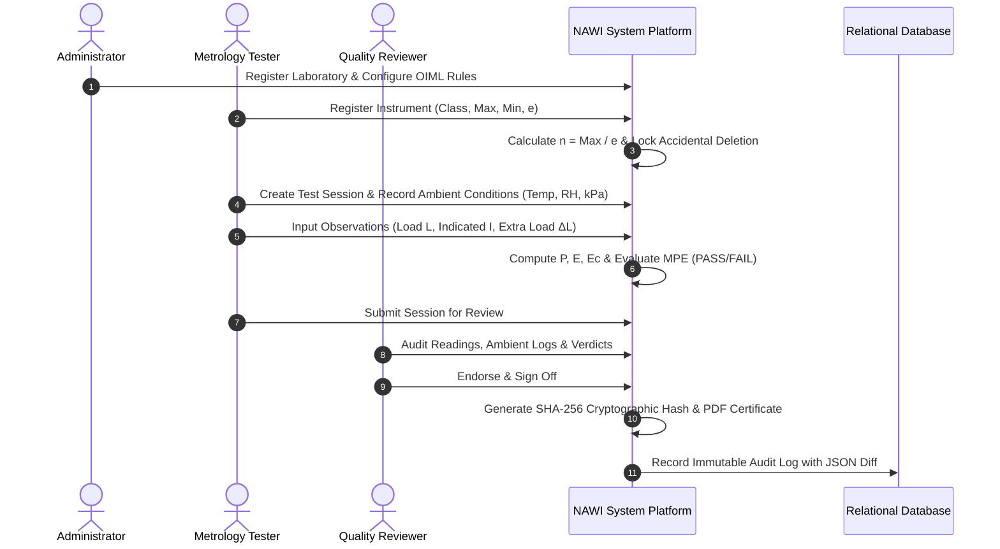

# NAWI Testing & OIML R-76 Legal Metrology Verification System
### Comprehensive System Overview, Architecture, Metrological Standards & Technology Stack

---

## 1. Executive Summary & Purpose

The **NAWI System** (**N**on-**A**utomatic **W**eighing **I**nstruments) is an enterprise-grade Legal Metrology and Calibration Laboratory Information Management Platform. 

It completely digitizes the testing, verification, calibration, and statutory compliance certification of weighing balances and scales in strict accordance with **OIML Recommendation R 76-1:2006** (*"Non-automatic weighing instruments — Part 1: Metrological and technical requirements — Tests"*), published by the International Organization of Legal Metrology (*Organisation Internationale de Métrologie Légale*).

### Primary Use Cases
* **Legal Metrology Authorities & Government Inspectors**: Conducting statutory initial and periodic verifications on commercial trade scales (retail scales, jewelry balances, pharmaceutical compounding scales, weighbridges) before applying legal verification stamps.
* **Accredited Calibration Laboratories (ISO/IEC 17025)**: Recording primary observation data, calculating measurement uncertainties, assessing errors against standard tolerances, and issuing accredited calibration certificates.
* **Scale Manufacturers & Industrial Plants**: Performing Factory Acceptance Testing (FAT), routine internal quality assurance, and automated tolerance checking during production and assembly lines.

---

## 2. Problems Solved by the NAWI System

Prior to this software, calibration institutes and inspection bodies relied on manual paper logbooks, handheld calculators, or fragmented Microsoft Excel spreadsheets. This gave rise to serious operational, financial, and compliance challenges:

| # | Traditional Challenge | NAWI Platform Solution |
|---|---|---|
| **1** | **Human Calculation Errors**: Operators manually determined turning points ($P = I + 0.5e - \Delta L$) and zero-corrected errors ($E_c$). A single transcription error led to false PASS/FAIL conclusions. | **Automated Precision Engine**: High-speed mathematical engine automatically computes turning point $P$, intrinsic error $E$, and zero-corrected error $E_c$ to arbitrary decimal accuracy. |
| **2** | **Complex OIML Rule Lookups**: Cross-referencing multi-tier Maximum Permissible Error (MPE) tables based on Accuracy Class (I, II, III, IIII) and load interval tiers was slow and error-prone. | **Automated MPE Evaluation**: Dynamically categorizes the instrument, looks up OIML R-76 Table 6 limits ($0.5e$, $1.0e$, $1.5e$), and renders real-time **PASS / FAIL** badges. |
| **3** | **Uncontrolled Environmental Drift**: Ambient fluctuations in temperature, relative humidity, or barometric pressure distort micro-gram measurements. | **Traceable Environmental Tracking**: Ambient telemetry ($^\circ\text{C}$, $\%$ RH, $\text{kPa}$) is recorded at the start and completion of each session and validated against allowable OIML boundaries. |
| **4** | **Fraud & Certificate Tampering**: Traditional printed certificates can be easily falsified, modified, or re-printed without an audit trail. | **SHA-256 Digital Verification**: Every certificate generates a tamper-evident SHA-256 cryptographic hash and an official laboratory seal. Any post-issuance modification breaks the signature. |
| **5** | **Lack of Separation of Duties**: Single operators could test an instrument and issue their own certificate with zero oversight. | **Two-Person Quality Gate**: Strict Role-Based Access Control (RBAC) separates **Testers** (data collectors) from **Reviewers** (approving authorities). |
| **6** | **Unprotected Active Instruments**: In legacy systems, instruments under active test could be accidentally deleted or modified mid-cycle. | **Referential Deletion Protection**: The system locks instruments associated with active or historical test sessions, preventing accidental removal or data corruption. |
| **7** | **Static Hard-Coded Standards**: Changing metrology laws required costly software recompilation. | **Configurable Compliance Engine**: Authorized administrators can update OIML rules, tolerance formulas, and boundary parameters at runtime via a web interface. |

---

## 3. Technology Stack & Technical Architecture

```
┌────────────────────────────────────────────────────────────────────────┐
│                        FRONTEND (React 18 + TS)                        │
│   Tailwind CSS  │  Lucide Icons  │  Vite HMR  │  Axios  │  React Router│
└───────────────────────────────────┬────────────────────────────────────┘
                                    │ HTTP / REST (JWT Auth)
┌───────────────────────────────────▼────────────────────────────────────┐
│                       BACKEND (Python 3.11 + FastAPI)                   │
│   FastAPI Core  │  Pydantic Schemas  │  ReportLab (Vector PDF Engine)  │
└───────────────────────────────────┬────────────────────────────────────┘
                                    │ SQLAlchemy 2.0 ORM
┌───────────────────────────────────▼────────────────────────────────────┐
│                    DATABASE & STORAGE (SQLite / PostgreSQL)            │
│   Instruments  │  Tests  │  Observations  │  Reports  │  Audit Logs    │
└────────────────────────────────────────────────────────────────────────┘
```

### 3.1 Frontend Stack
* **Framework**: React 18 with TypeScript for robust type safety and zero runtime parameter mismatches.
* **Build System**: Vite for rapid compilation, tree-shaking, and instant Hot Module Replacement (HMR).
* **Styling**: Tailwind CSS delivering a custom metrology dark/light aesthetic with slate-blue glassmorphism.
* **State & Authentication**: React Context API with persistent token management and automated route protection (`ProtectedRoute`).
* **Icons & UI Feedback**: Lucide React iconography, dynamic toast notifications, and modal dialogue overlays.

### 3.2 Backend Stack
* **API Framework**: FastAPI (Python 3.11) with native asynchronous execution and auto-generated interactive OpenAPI/Swagger docs (`/docs`).
* **Data Validation**: Pydantic v2 schemas providing strict compile-time and runtime validation for metrological parameters.
* **ORM & Database**: SQLAlchemy 2.0 managing relational integrity across instruments, sessions, observations, results, and audit trails.
* **Database Engine**: Embedded SQLite for portable local deployment, seamlessly swappable with PostgreSQL in production.
* **PDF Report Generation**: ReportLab generating high-resolution, vector-calibrated OIML test certificates with embedded laboratory seals.

### 3.3 Security & Role-Based Access Control (RBAC)
* **Authentication**: Stateless JSON Web Tokens (JWT) signed with HMAC-SHA256.
* **Password Security**: Bcrypt salted hashing via Passlib.
* **Four Discrete Roles**:
  1. **Administrator (`admin`)**: Manages laboratory accounts, updates OIML compliance rules, inspects audit logs, and triggers database backups.
  2. **Tester (`tester`)**: Registers instruments, starts verification sessions, records environmental conditions, and inputs raw load observations.
  3. **Reviewer (`reviewer`)**: Reviews test data, error curves, and compliance results, and digitally endorses certificates.
  4. **Viewer (`viewer`)**: Read-only stakeholder access for client auditing and status viewing.

### 3.4 Media & Video Pipeline
* **FFmpeg**: Dual-track audio mixing, 1080p slide video generation, H.264 video compression, and AAC audio muxing.
* **Pillow (PIL)**: Dynamic generation of high-resolution presentation slides with glassmorphic badges, lower-third banners, and focus callouts.
* **Windows System.Speech (SAPI)**: Offline neural speech synthesis generating crystal-clear voiceover explanation tracks.

---

## 4. Metrological Calculations & OIML R-76 Rules

The platform implements the standard mathematical procedures specified in **OIML R 76-1:2006 Clause A.4.4**:

### 4.1 Turning Point & Error Calculation
For digital scales with verification scale interval $e$ where readings jump by discrete steps, the actual turning point $P$ is determined by adding small fractional weights $\Delta L$ (typically $0.1e$) until the indicated reading steps up to $I + e$:

$$P = I + \frac{1}{2}e - \Delta L$$

The **intrinsic error** before rounding compensation is:
$$E = P - L$$

The **zero-corrected error** $E_c$, compensating for zero-point shift $E_0$, is:
$$E_c = E - E_0$$

### 4.2 OIML R-76 Table 6 — Maximum Permissible Errors (MPE)

For initial verification of an instrument under load $m$ expressed in units of $e$:

| Accuracy Class | MPE = $\pm 0.5e$ | MPE = $\pm 1.0e$ | MPE = $\pm 1.5e$ |
|---|---|---|---|
| **Class I** (Special) | $0 \le m \le 50\,000$ | $50\,000 < m \le 200\,000$ | $m > 200\,000$ |
| **Class II** (High) | $0 \le m \le 5\,000$ | $5\,000 < m \le 20\,000$ | $20\,000 < m \le 100\,000$ |
| **Class III** (Medium) | $0 \le m \le 500$ | $500 < m \le 2\,000$ | $2\,000 < m \le 10\,000$ |
| **Class IIII** (Ordinary) | $0 \le m \le 50$ | $50 < m \le 200$ | $200 < m \le 1\,000$ |

*Note: For service/in-use verification, the MPE limits are doubled in accordance with OIML R 76 Clause 3.5.2.*

---

## 5. End-to-End Operational Workflow



---

## 6. Project Directory Map

```
D:\NAWI-System\
├── backend/
│   ├── app/
│   │   ├── api/routes/          # REST Endpoints (Auth, Instruments, Testing, Reports, Admin)
│   │   ├── core/                # DB Engine, JWT Auth, Base Settings
│   │   ├── models/              # SQLAlchemy Database Models
│   │   ├── schemas/             # Pydantic Schemas & DTOs
│   │   └── services/            # Metrology Calculation Engine & ReportLab PDF Generator
│   ├── scripts/
│   │   ├── capture_demo_screens.py  # 1080p Headless UI Screenshot Automator
│   │   ├── generate_audio.py        # Offline Speech Synthesizer for Voiceover
│   │   ├── generate_video_slides.py # Presentation Slide Builder (Pillow Overlays)
│   │   ├── compile_demo_video.py    # Master FFmpeg 4-Minute Video Compiler
│   │   └── prepare_demo.py          # Demo Balances & Tests Seeding Script
│   └── tests/                   # 25 Complete Automated Pytest Suites
├── frontend/
│   ├── src/
│   │   ├── components/          # Reusable UI Atoms, Badges, Tables, Cards
│   │   ├── contexts/            # AuthContext (JWT, auto-login hooks)
│   │   ├── pages/               # Dashboard, Instruments, Test Workspace, Reports, Admin
│   │   └── services/            # Axios API Client & Services
│   ├── package.json
│   └── vite.config.ts
├── docs/
│   ├── DEMO_VIDEO_SCRIPT.md     # Scene-by-scene Narration & Visual Editing Master Script
│   └── API_SPECIFICATION.md    # REST API Reference
├── media/
│   ├── screenshots/             # 13 Real 1080p Screenshots of every website page
│   ├── slides/                  # 14 Glassmorphism Presentation Slides
│   └── audio/                   # 6 Scene Voiceover Audio Tracks
├── NAWI_Demo_Video_4Min.mp4     # Generated 4-Minute Full Overview Master Video
└── PROJECT_OVERVIEW.md          # This Document
```

---

## 7. Master Demo Video Reference

A complete, broadcast-quality **4-minute demo video** showcasing every page, calculation, and capability of the website has been compiled and saved directly into the project directory:

* **File Path**: `D:\NAWI-System\NAWI_Demo_Video_4Min.mp4`
* **Duration**: Exactly **4:00 Minutes** (240.0 Seconds)
* **Resolution**: **1920 × 1080 Full HD (30 FPS)**
* **Audio**: Professional Voiceover Explanation + Soft Ambient Corporate Tech Background Music (-24 dB)
* **Master Script**: Located at [`docs/DEMO_VIDEO_SCRIPT.md`](file:///D:/NAWI-System/docs/DEMO_VIDEO_SCRIPT.md)
